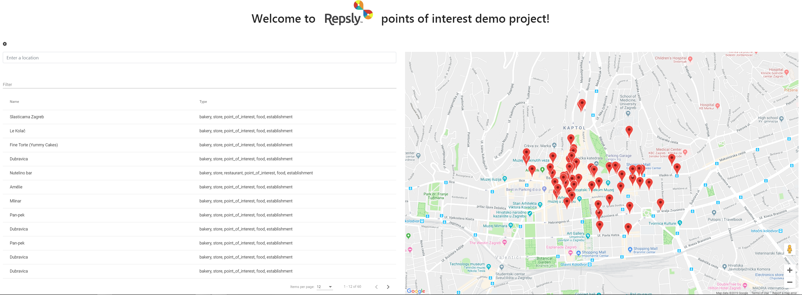
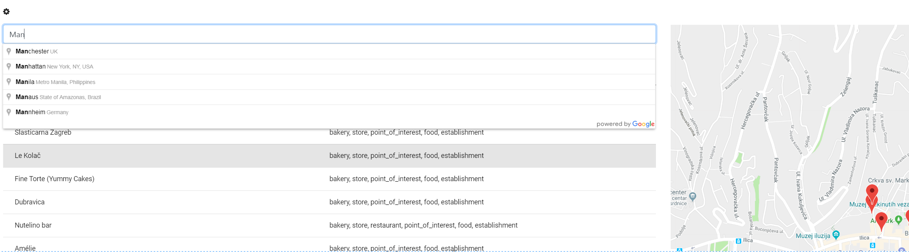
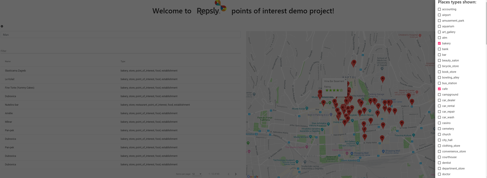

# POI

Angular 7 project demo project using google maps

<ul>
  <li>Open workspace</li> 
  <li>Run "npm install"</li>
  <li>Run "ng serve"</li>
  <li>http://localhost:4200/#/</li>
</ul>

<h4>App</h4>
<ul>
  <li>Gets starting location and finds all items of interest by type in 1km radius and marks it down on map.</li>
  <li>List and markers are hoverable and show relevant info on map</li>
  <li>Autocomplete helps with places finding</li>
  <li>Cog icon press opens sidebar with all types available for search</li>
  <li>You can filter results by name and type</li>
</ul>

 

 

